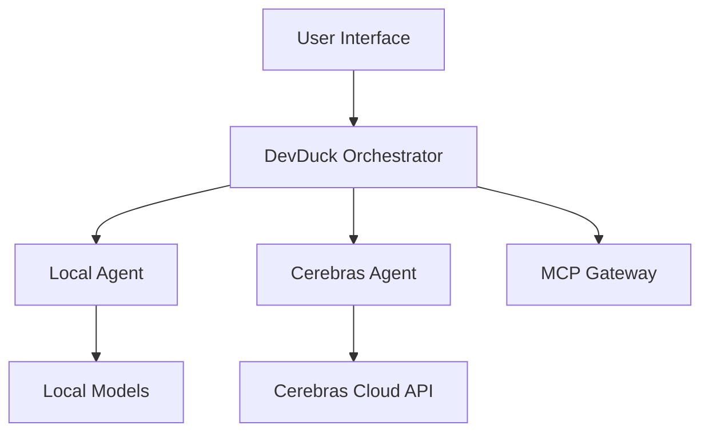

# Introduction

👋 Welcome to the Docker DevDuck Multi-Agent Workshop!
During this workshop, you'll learn how to build and deploy a multi-agent system using Docker, Google Agent Development Kit (ADK), and Cerebras AI.

## The DevDuck System Architecture

In this workshop, you'll build a system called "DevDuck" - a developer assistance platform that uses multiple specialized agents:

### Agent Roles

1. **DevDuck Orchestrator**: The main coordinator that routes requests to appropriate agents
2. **Local Agent**: Handles quick processing tasks using local models
3. **Cerebras Agent**: Leverages powerful cloud-based AI for complex analysis
4. **MCP Gateway**: Manages Model Context Protocol for enhanced capabilities

## Real-World Applications

This workshop demonstrates practical use cases for multi-agent systems:

### 💻 **Software Development Assistance**
- Code generation and explanation
- Bug detection and troubleshooting
- Architecture recommendations
- Testing strategy development

### 🎯 **Intelligent Task Routing**
- Determine which agent is best suited for each request
- Load balancing across multiple agents
- Fallback mechanisms for agent failures

### 📈 **Scalable AI Solutions**
- Combine local and cloud AI capabilities
- Cost-effective resource utilization
- Performance optimization strategies

## Workshop Learning Objectives

By the end of this workshop, you'll be able to:

- ✅ **Design multi-agent architectures** using Docker containers
- ✅ **Implement agent communication patterns** using HTTP APIs and message queues
- ✅ **Integrate multiple AI models** (local and cloud-based) in a cohesive system
- ✅ **Deploy and manage** multi-agent systems in production-like environments
- ✅ **Debug and troubleshoot** common multi-agent system issues
- ✅ **Apply best practices** for containerized AI applications

## Technology Stack

This workshop uses cutting-edge technologies:

- **Docker & Docker Compose**: Container orchestration
- **Python & FastAPI**: Agent implementation and web interfaces
- **Cerebras AI**: High-performance cloud AI models
- **Google ADK**: Agent development framework
- **Model Context Protocol (MCP)**: Enhanced agent capabilities

## Getting Ready

Before proceeding to the next section, ensure you have:

- [ ] Docker Desktop installed and running
- [ ] Basic familiarity with command-line interfaces
- [ ] Text editor or IDE for viewing code
- [ ] Internet connection for downloading models and accessing APIs

## Next Steps

Ready to dive in? The next section covers the prerequisites and system requirements needed to get started. You'll also get a detailed overview of the system architecture and how all the components work together.

Let's build something amazing! 🚀
