# Introduction

👋 Welcome to the Docker DevDuck Multi-Agent Workshop!
During this workshop, you'll learn how to build and deploy a multi-agent system using Docker, Google Agent Development Kit (ADK), and Cerebras AI.

## The DevDuck System Architecture

In this workshop, you'll build a system called "DevDuck" - a developer assistance platform that uses multiple specialized agents:

```mermaid
graph TD
    A[User Interface] --> B[DevDuck Orchestrator]
    
    %% Agent layer
    B --> C[Local Agent]
    B --> D[Cerebras Agent] 
    B --> G[MCP Gateway]
    
    %% Model connections
    C --> E[Local Models]
    D --> F[Cerebras Cloud API]
    
    %% Bidirectional agent-MCP connections
    C <--> G
    D <--> G
    
    %% MCP Gateway to servers
    G --> H[Context7 MCP Server<br/>📚 Documentation Access]
    G --> I[Node Sandbox MCP Server<br/>🔧 Code Execution]
    
    %% Context7 external connections
    H --> J[Framework Documentation<br/>React, Vue, Angular, etc.]
    H --> K[API Documentation<br/>REST, GraphQL specs]
    H --> L[Library Documentation<br/>npm, PyPI packages]
    
    %% Sandbox connections
    I --> M[Isolated Docker Containers]
    
    %% Styling
    classDef mcp fill:#34495e,stroke:#2c3e50,color:#fff
    classDef docs fill:#3498db,stroke:#2980b9,color:#fff
    classDef containers fill:#95a5a6,stroke:#7f8c8d,color:#fff
    
    class G,H,I mcp
    class J,K,L docs
    class M containers
```

### Agent Roles

1. **DevDuck Orchestrator**: The main coordinator that routes requests to appropriate agents
2. **Local Agent**: Handles quick processing tasks using local models
3. **Cerebras Agent**: Leverages powerful cloud-based AI for complex analysis
4. **MCP Gateway**: Manages Model Context Protocol for enhanced capabilities

### How it works?

- This application shows how secure AI coding agents are orchestrated through a multi-layered system.
- At the top, user requests flow through the User Interface into the DevDuck Orchestrator, which serves as the central decision-making hub.
- The orchestrator manages three critical pathways:
    - routing to a Local Agent (powered by local Qwen models for quick decisions),
    - delegating complex tasks to the Cerebras Agent (utilizing high-performance cloud APIs), and
    - coordinating tool access through the MCP Gateway.

- The bidirectional arrows between agents and the MCP Gateway show that this isn't just a simple pipeline - agents actively communicate with each other for routing decisions and continuously interact with tools to enhance their capabilities.
- The MCP Gateway acts as a secure intermediary that manages two specialized MCP servers, each serving distinct purposes.
- The Context7 MCP Server handles documentation retrieval, connecting to external sources like framework documentation (React, Vue, Angular), API specifications (REST, GraphQL), and library documentation (npm, PyPI packages). This ensures agents have access to current, authoritative information when generating code.
- Meanwhile, the Node Sandbox MCP Server manages secure code execution by creating Isolated Docker Containers with disabled networking, providing a safe environment where generated code can run without security risks.

The architecture's brilliance lies in its security-by-design approach: while Context7 can access the internet to fetch documentation, the sandbox containers are completely network-isolated, preventing any potential data exfiltration or malicious activity from generated code. This creates a perfect balance where AI agents can access up-to-date knowledge to write better code, while ensuring that code execution happens in a bulletproof secure environment - essentially giving you the benefits of current documentation and safe execution simultaneously.

## Real-World Applications

This workshop demonstrates practical use cases for multi-agent systems:

### 💻 **Software Development Assistance**
- Code generation and explanation
- Bug detection and troubleshooting
- Architecture recommendations
- Testing strategy development

### 🎯 **Intelligent Task Routing**
- Determine which agent is best suited for each request
- Load balancing across multiple agents
- Fallback mechanisms for agent failures

### 📈 **Scalable AI Solutions**
- Combine local and cloud AI capabilities
- Cost-effective resource utilization
- Performance optimization strategies

## Workshop Learning Objectives

By the end of this workshop, you'll be able to:

- ✅ **Design multi-agent architectures** using Docker containers
- ✅ **Implement agent communication patterns** using HTTP APIs and message queues
- ✅ **Integrate multiple AI models** (local and cloud-based) in a cohesive system
- ✅ **Deploy and manage** multi-agent systems in production-like environments
- ✅ **Debug and troubleshoot** common multi-agent system issues
- ✅ **Apply best practices** for containerized AI applications

## Technology Stack

This workshop uses cutting-edge technologies:

- **Docker & Docker Compose**: Container orchestration
- **Python & FastAPI**: Agent implementation and web interfaces
- **Cerebras AI**: High-performance cloud AI models
- **Google ADK**: Agent development framework
- **Model Context Protocol (MCP)**: Enhanced agent capabilities

## Getting Ready

Before proceeding to the next section, ensure you have:

- [ ] Docker Desktop installed and running
- [ ] Basic familiarity with command-line interfaces
- [ ] Text editor or IDE for viewing code
- [ ] Internet connection for downloading models and accessing APIs

## Next Steps

Ready to dive in? The next section covers the prerequisites and system requirements needed to get started. You'll also get a detailed overview of the system architecture and how all the components work together.

Let's build something amazing! 🚀
