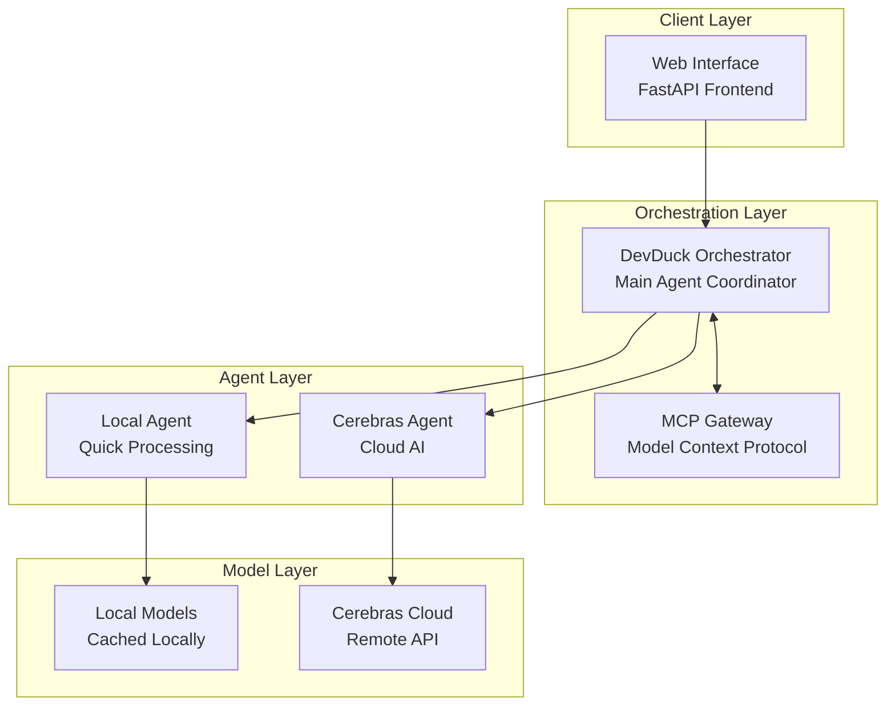
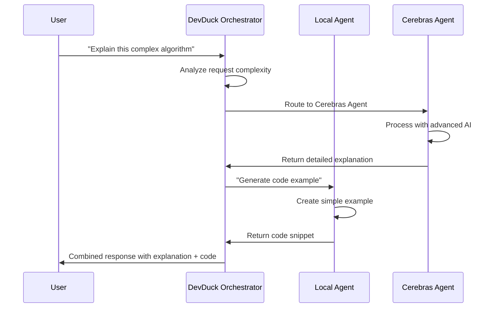
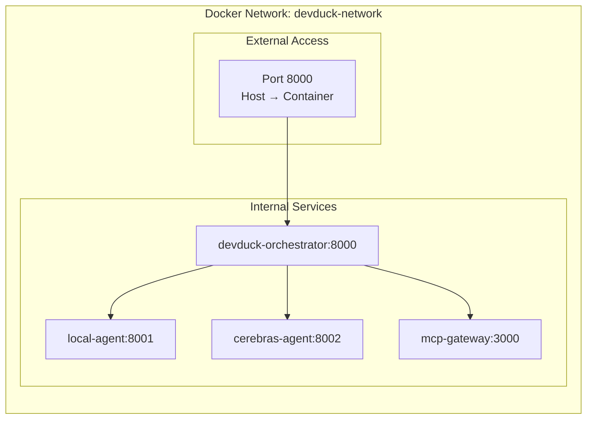

# Prerequisites & System Overview

Before diving into the hands-on exercises, let's ensure your environment is properly set up and understand the system architecture we'll be working with.

## System Requirements

### Hardware Requirements

| Component | Minimum | Recommended |
|-----------|---------|-------------|
| **RAM** | 8 GB | 16 GB+ |
| **Storage** | 10 GB free | 20 GB+ free |
| **CPU** | 4 cores | 8+ cores |
| **Network** | Stable internet | High-speed broadband |

!!! warning "Resource Usage"
    AI models can be memory-intensive. The local agent will download and cache models, which requires significant disk space and RAM.

### Software Prerequisites

#### ✅ Required Software

1. **Docker Desktop** (Latest version)
   - Windows: Docker Desktop for Windows
   - macOS: Docker Desktop for Mac  
   - Linux: Docker Engine + Docker Compose

2. **Git** (for cloning repositories)

3. **Text Editor/IDE** (VS Code, PyCharm, or similar)

4. **Web Browser** (Chrome, Firefox, Safari, Edge)

#### 🔧 Verification Commands

Run these commands to verify your setup:

```bash
# Check Docker version
docker --version

# Check Docker Compose version
docker compose version

# Verify Docker is running
docker ps

# Check available system resources
docker system info
```

**Expected Output Example:**
```
Docker version 24.0.0, build 1234567
Docker Compose version v2.20.0
```

### API Requirements

#### Cerebras API Setup

1. **Create Account**: Visit [https://cloud.cerebras.ai/](https://cloud.cerebras.ai/)
2. **Get API Key**: Navigate to API section and generate a key
3. **Verify Access**: Test API connectivity (we'll do this together)

!!! tip "Free Tier Available"
    Cerebras offers a generous free tier for testing and learning. You won't need to provide payment information for this workshop.

## System Architecture Overview

Let's explore the multi-agent system architecture you'll be building:

### High-Level Architecture



### Component Breakdown

#### 🎼 **DevDuck Orchestrator**
- **Role**: Central coordinator and decision maker
- **Responsibilities**: 
  - Route user requests to appropriate agents
  - Manage conversation context and history
  - Handle multi-agent workflows
  - Provide unified response interface
- **Technology**: Python, FastAPI
- **Port**: 8000

#### 🤖 **Local Agent**
- **Role**: Fast, local processing for common tasks
- **Responsibilities**:
  - Handle simple queries and code completion
  - Provide quick responses for development tasks
  - Cache frequently used information
  - Fallback processing when cloud services are unavailable
- **Technology**: Python with local ML models
- **Models**: Lightweight language models (1-7B parameters)

#### 🧠 **Cerebras Agent**
- **Role**: Advanced AI processing for complex tasks
- **Responsibilities**:
  - Complex code analysis and architecture suggestions
  - Advanced problem-solving and reasoning
  - Large-scale text processing and generation
  - Research and documentation tasks
- **Technology**: Python client for Cerebras API
- **Models**: High-performance cloud models (70B+ parameters)

#### 🌐 **MCP Gateway**
- **Role**: Enhanced protocol support and tool integration
- **Responsibilities**:
  - Extend agent capabilities with tools and plugins
  - Handle file system operations
  - Provide additional context and memory
  - Enable advanced agent interactions
- **Technology**: Docker's MCP Gateway service

### Communication Flow

#### 📡 **Request Processing Flow**

1. **User Input**: User sends request via web interface
2. **Orchestration**: DevDuck analyzes request and determines routing
3. **Agent Selection**: Based on complexity and requirements:
   - Simple queries → Local Agent
   - Complex analysis → Cerebras Agent  
   - Multi-step tasks → Both agents in sequence
4. **Processing**: Selected agent(s) process the request
5. **Response**: DevDuck aggregates and returns unified response

#### 🔄 **Inter-Agent Communication**



### Container Architecture

Each component runs in its own Docker container for isolation and scalability:

#### 📦 **Container Specifications**

| Service | Image | CPU | Memory | Ports |
|---------|-------|-----|---------|-------|
| DevDuck Orchestrator | Custom Python | 0.5-1.0 | 1-2 GB | 8000 |
| Local Agent | Custom Python | 1.0-2.0 | 2-4 GB | Internal |
| Cerebras Agent | Custom Python | 0.2-0.5 | 512 MB | Internal |
| MCP Gateway | docker/mcp-gateway | 0.2-0.5 | 256 MB | Internal |

### Network Architecture



## Environment Configuration

### Required Environment Variables

You'll need to configure these environment variables:

```bash
# Cerebras Configuration
CEREBRAS_API_KEY=your_api_key_here
CEREBRAS_BASE_URL=https://api.cerebras.ai/v1
CEREBRAS_CHAT_MODEL=llama3.1-70b

# Local Agent Configuration  
LOCAL_MODEL_NAME=microsoft/DialoGPT-medium
LOCAL_MODEL_CACHE=/tmp/models

# System Configuration
LOG_LEVEL=INFO
DEBUG_MODE=false
```

### Docker Compose Structure

The system uses Docker Compose for orchestration:

```yaml
version: '3.8'
services:
  devduck-agent:
    build: ./agents
    ports:
      - "8000:8000"
    environment:
      - CEREBRAS_API_KEY=${CEREBRAS_API_KEY}
    depends_on:
      - mcp-gateway
      
  mcp-gateway:
    image: docker/mcp-gateway:latest
    command: /docker-mcp gateway serve mcp-gateway-catalog.yaml
```

## Pre-flight Checklist

Before proceeding to the next section, ensure you have:

- [ ] Docker Desktop installed and running
- [ ] Cerebras API account created and key obtained
- [ ] At least 16GB RAM available
- [ ] Stable internet connection
- [ ] Basic understanding of Docker concepts
- [ ] Terminal/command prompt access

## Troubleshooting Common Setup Issues

### Docker Issues
- **Problem**: "Docker daemon not running"
- **Solution**: Start Docker Desktop and wait for it to fully initialize

### Memory Issues  
- **Problem**: System running slow or containers crashing
- **Solution**: Increase Docker Desktop memory allocation to 8GB+

### API Issues
- **Problem**: Cannot access Cerebras API
- **Solution**: Verify API key and internet connectivity

## Next Steps

Great! Now that you understand the system architecture and have verified your prerequisites, you're ready to start building. In the next section, you'll clone the repository and begin the deployment process.

The exciting hands-on work begins now! 🚀
