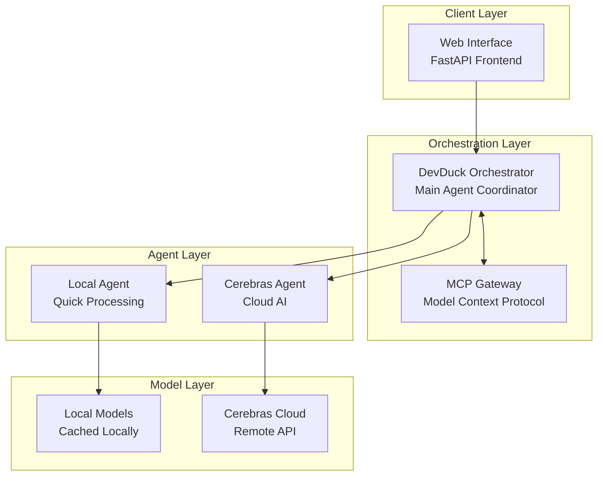
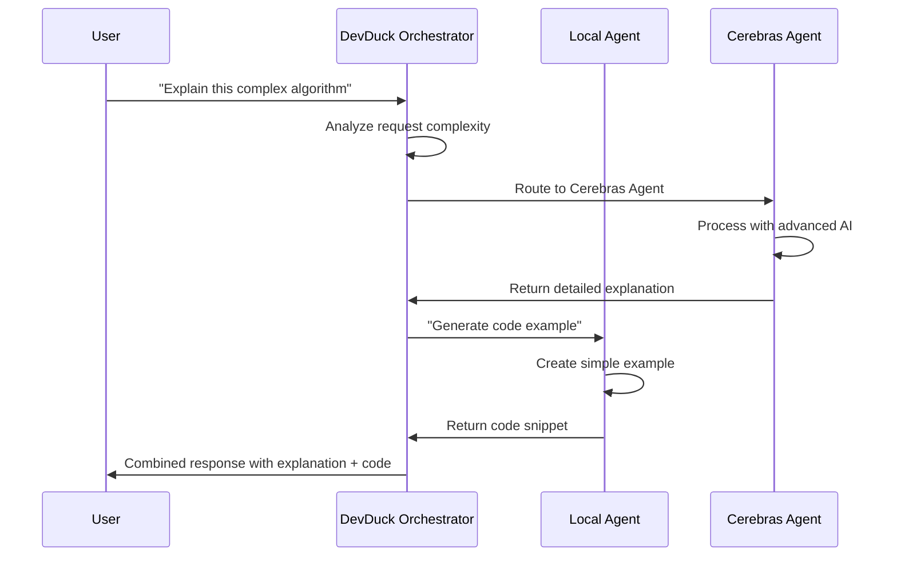
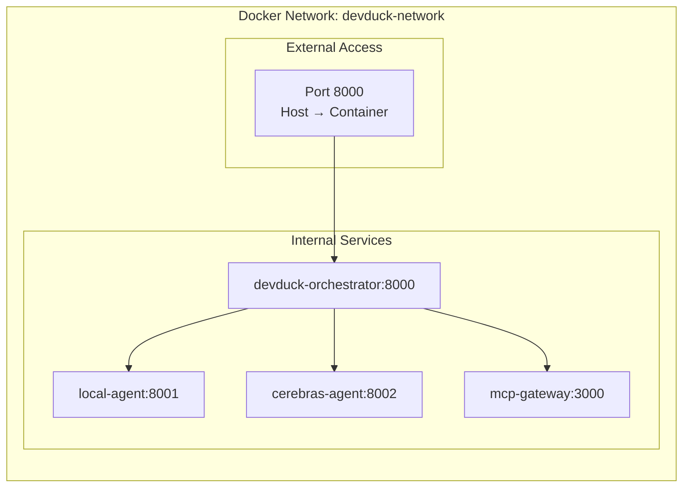

# Getting Started with DevDuck Multi-Agent Application

Now that you've understood how Docker Model Runner and MCP Gateway works, let's try building DevDuck Multi-Agent application! This section will guide you through the complete setup process, from cloning the repository to accessing your first multi-agent system.

## Step 1: Repository Setup

First, let's clone the repository and explore its structure:

### Clone the Repository

```bash
# Clone the Docker Cerebras demo repository
git clone https://github.com/dockersamples/docker-cerebras-demo.git

# Navigate to the project directory
cd docker-cerebras-demo

# List the contents to familiarize yourself
ls -la
```


## System Architecture Overview

Let's explore the multi-agent system architecture you'll be building:

### High-Level Architecture



### Component Breakdown

#### 🎼 **DevDuck Orchestrator**
- **Role**: Central coordinator and decision maker
- **Responsibilities**: 
  - Route user requests to appropriate agents
  - Manage conversation context and history
  - Handle multi-agent workflows
  - Provide unified response interface
- **Technology**: Python, FastAPI
- **Port**: 8000

#### 🤖 **Local Agent**
- **Role**: Fast, local processing for common tasks
- **Responsibilities**:
  - Handle simple queries and code completion
  - Provide quick responses for development tasks
  - Cache frequently used information
  - Fallback processing when cloud services are unavailable
- **Technology**: Python with local ML models
- **Models**: Lightweight language models (1-7B parameters)

#### 🧠 **Cerebras Agent**
- **Role**: Advanced AI processing for complex tasks
- **Responsibilities**:
  - Complex code analysis and architecture suggestions
  - Advanced problem-solving and reasoning
  - Large-scale text processing and generation
  - Research and documentation tasks
- **Technology**: Python client for Cerebras API
- **Models**: High-performance cloud models (70B+ parameters)

#### 🌐 **MCP Gateway**
- **Role**: Enhanced protocol support and tool integration
- **Responsibilities**:
  - Extend agent capabilities with tools and plugins
  - Handle file system operations
  - Provide additional context and memory
  - Enable advanced agent interactions
- **Technology**: Docker's MCP Gateway service

### Communication Flow

#### 📡 **Request Processing Flow**

1. **User Input**: User sends request via web interface
2. **Orchestration**: DevDuck analyzes request and determines routing
3. **Agent Selection**: Based on complexity and requirements:
   - Simple queries → Local Agent
   - Complex analysis → Cerebras Agent  
   - Multi-step tasks → Both agents in sequence
4. **Processing**: Selected agent(s) process the request
5. **Response**: DevDuck aggregates and returns unified response

#### 🔄 **Inter-Agent Communication**



### Container Architecture

Each component runs in its own Docker container for isolation and scalability:

#### 📦 **Container Specifications**

| Service | Image | CPU | Memory | Ports |
|---------|-------|-----|---------|-------|
| DevDuck Orchestrator | Custom Python | 0.5-1.0 | 1-2 GB | 8000 |
| Local Agent | Custom Python | 1.0-2.0 | 2-4 GB | Internal |
| Cerebras Agent | Custom Python | 0.2-0.5 | 512 MB | Internal |
| MCP Gateway | docker/mcp-gateway | 0.2-0.5 | 256 MB | Internal |

### Network Architecture



## Environment Configuration

### Required Environment Variables

You'll need to configure these environment variables:

```bash
# Cerebras Configuration
CEREBRAS_API_KEY=your_api_key_here
CEREBRAS_BASE_URL=https://api.cerebras.ai/v1
CEREBRAS_CHAT_MODEL=llama3.1-70b

# Local Agent Configuration  
LOCAL_MODEL_NAME=microsoft/DialoGPT-medium
LOCAL_MODEL_CACHE=/tmp/models

# System Configuration
LOG_LEVEL=INFO
DEBUG_MODE=false
```

### Docker Compose Structure

The system uses Docker Compose for orchestration:

```yaml
services:
  devduck-agent:
    build: ./agents
    ports:
      - "8000:8000"
    environment:
      - CEREBRAS_API_KEY=${CEREBRAS_API_KEY}
    depends_on:
      - mcp-gateway
      
  mcp-gateway:
    image: docker/mcp-gateway:latest
    command: /docker-mcp gateway serve mcp-gateway-catalog.yaml
```


### 📁 Explore the Repository Structure

Take a moment to understand the project layout:


```
.
├── LICENSE.md                 # Project license
├── README.md                  # Project documentation
├── agents/                    # Agent implementation directory
│   ├── Dockerfile            # Container image definition
│   ├── devduck/              # Main DevDuck orchestrator
│   │   ├── __init__.py
│   │   ├── agent.py          # Core orchestrator logic
│   │   └── sub_agents/       # Individual agent implementations
│   │       ├── cerebras/     # Cerebras AI agent
│   │       │   ├── agent.py
│   │       │   └── tools.py
│   │       └── localagent/   # Local processing agent
│   │           └── agent.py
│   ├── main.py               # FastAPI application entry point
│   └── requirements.txt      # Python dependencies
├── compose.yml               # Docker Compose configuration
├── mcp-gateway-catalog.yaml  # MCP Gateway configuration
├── pyproject.toml           # Python project metadata
└── uv.lock                  # Dependency lock file
```

### 🔍 Examine Key Files

Let's look at the main configuration files:

```bash
# View the Docker Compose configuration
cat compose.yml

# Examine the main agent entry point
cat agents/main.py

# Check the agent requirements
cat agents/requirements.txt
```

## Step 2: Environment Configuration

### Create Environment File

Set up your environment variables:

```bash
# Copy the environment template (if available)
cp .env.sample .env 2>/dev/null || touch .env

# Edit the environment file
nano .env  # or use your preferred editor
```

### 🔐 Configure Required Variables

Add the following configuration to your `.env` file:

```bash
# Cerebras API Configuration
CEREBRAS_API_KEY=your_actual_api_key_here
CEREBRAS_BASE_URL=https://api.cerebras.ai/v1
CEREBRAS_CHAT_MODEL=llama3.1-70b

# Local Agent Configuration
LOCAL_MODEL_NAME=microsoft/DialoGPT-medium
LOCAL_MODEL_CACHE_DIR=/tmp/models

# Application Configuration
DEBUG=false
LOG_LEVEL=INFO
HOST=0.0.0.0
PORT=8000
```


### Validate Environment Setup

```bash
# Check if your .env file is properly formatted
cat .env | grep -E '^[A-Z_]+='

# Verify no sensitive information is accidentally committed
echo ".env" >> .gitignore
```

## Step 3: Docker Image Preparation

Before deploying, let's understand what Docker will build:

### 🐳 Examine the Dockerfile

```bash
# View the agent Dockerfile
cat agents/Dockerfile
```

**Understanding the Build Process:**
- Base image with Python runtime
- Agent dependencies installation
- Application code copying
- Container startup configuration

### Pre-build Check

Ensure Docker is ready:

```bash
# Verify Docker daemon is running
docker info

# Check available system resources
docker system df

# Clean up any unused resources (optional)
docker system prune -f
```

## Step 4: System Deployment

Now let's deploy the complete multi-agent system:

### 🚀 Initial Deployment

```bash
# Deploy all services
docker compose up
```

**What to expect during first deployment:**

1. **Image Building** (2-3 minutes)
   - Base image download
   - Python dependencies installation
   - Application code integration

2. **Service Initialization** (1-2 minutes)
   - Container startup
   - Model downloads (if using local models)
   - Service health checks

3. **Network Setup**
   - Internal network creation
   - Port mapping configuration
   - Inter-service communication setup

### 🔄 Development Mode Deployment

For active development with code changes:

```bash
# Run in detached mode (background)
docker compose up -d

# Build and restart when code changes
docker compose up --build

# Force recreation of containers
docker compose up --build --force-recreate
```

### Monitor the Deployment

Open a new terminal to monitor the deployment:

```bash
# Watch container status in real-time
watch docker compose ps

# View logs from all services
docker compose logs -f

# View logs from specific service
docker compose logs -f devduck-agent
```

## Step 5: Deployment Verification

### ✅ Check Service Status

```bash
# Verify all containers are running
docker compose ps
```

**Expected Output:**
```
NAME                                   IMAGE                               COMMAND                  SERVICE         CREATED         STATUS         PORTS
docker-cerebras-demo-devduck-agent-1   docker-cerebras-demo-devduck-agent  "sh -c 'uvicorn main…"   devduck-agent   2 minutes ago   Up 2 minutes   0.0.0.0:8000->8000/tcp
docker-cerebras-demo-mcp-gateway-1     docker/mcp-gateway:latest           "/docker-mcp gateway…"   mcp-gateway     2 minutes ago   Up 2 minutes   
```

### 🩺 Health Check

Perform a comprehensive health check:

```bash
# Check container resource usage
docker stats --no-stream

# Test network connectivity
docker compose exec devduck-agent curl -f http://localhost:8000/health

# Verify agent endpoints
curl -s http://localhost:8000/health | jq .
```

### 📊 System Resource Monitoring

```bash
# Monitor system resources
docker system df

# Check memory usage
docker stats --format "table {{.Container}}\t{{.CPUPerc}}\t{{.MemUsage}}\t{{.MemPerc}}"
```

## Step 6: First Access

### 🌐 Access the Web Interface

Open your web browser and navigate to:

**Primary URL**: [http://localhost:8000/dev-ui/?app=devduck](http://localhost:8000/dev-ui/?app=devduck)

**Alternative URLs** (if the primary doesn't work):
- [http://0.0.0.0:8000/dev-ui/?app=devduck](http://0.0.0.0:8000/dev-ui/?app=devduck)
- [http://127.0.0.1:8000/dev-ui/?app=devduck](http://127.0.0.1:8000/dev-ui/?app=devduck)

### 🧪 Initial Testing

Test the system with a simple interaction:

1. **Load the Interface**: Ensure the web page loads completely
2. **Send Test Message**: Type "Hello DevDuck" in the chat interface
3. **Verify Response**: Confirm you receive a response from the system
4. **Check Logs**: Monitor the logs for any errors

```bash
# Watch logs during your first interaction
docker compose logs -f devduck-agent
```

## Step 7: System Validation

### 🔍 Comprehensive Testing

Run through this validation checklist:

#### Basic Functionality
- [ ] Web interface loads without errors
- [ ] Can send and receive messages
- [ ] DevDuck orchestrator responds appropriately
- [ ] No error messages in container logs

#### Agent Communication
```bash
# Test direct agent communication (advanced)
docker compose exec devduck-agent python -c "
import requests
response = requests.get('http://localhost:8000/health')
print(f'Status: {response.status_code}')
print(f'Response: {response.json()}')
"
```

#### Resource Health
- [ ] System resources are stable (not maxed out)
- [ ] All containers remain running
- [ ] Network connectivity is working

## Troubleshooting Common Issues

### ⚠️ Port Conflicts

**Problem**: Port 8000 is already in use
```bash
# Find what's using the port
lsof -i :8000

# Modify the port in compose.yml if needed
# Change "8000:8000" to "8001:8000"
```

### 🤖 Model Loading Issues

**Problem**: Local models fail to load or are too large
```bash
# Check available disk space
df -h

# Monitor memory usage during startup
docker stats
```

**Solution**: Use lightweight models for testing:
```bash
# Edit your .env file
LOCAL_MODEL_NAME=microsoft/DialoGPT-small
```

### 🔑 API Authentication Issues

**Problem**: Cerebras API returns authentication errors
```bash
# Verify your API key
echo $CEREBRAS_API_KEY

# Test API connectivity
curl -H "Authorization: Bearer $CEREBRAS_API_KEY" \
     -H "Content-Type: application/json" \
     -d '{"model":"llama3.1-8b","messages":[{"role":"user","content":"hello"}]}' \
     https://api.cerebras.ai/v1/chat/completions
```

### 📡 Network Issues

**Problem**: Containers can't communicate
```bash
# Check Docker networks
docker network ls

# Inspect the application network
docker network inspect docker-cerebras-demo_default
```

## Success Confirmation

If everything is working correctly, you should see:

✅ **Web Interface**: DevDuck interface loads at http://localhost:8000/dev-ui/?app=devduck  
✅ **Agent Response**: Messages sent receive appropriate responses  
✅ **Container Status**: All containers show "Up" status  
✅ **Resource Usage**: System resources are stable  
✅ **Logs**: No critical errors in application logs  

## Next Steps

Excellent! You now have a fully functional multi-agent system running. In the next section, you'll dive deeper into environment configuration and learn how to customize your deployment for different scenarios.

Ready to explore the environment setup and deployment options? Let's continue! 🚀

---

!!! success "Checkpoint Achieved"
    You've successfully deployed your first multi-agent system with Docker! Take a moment to explore the interface and get familiar with the basic interaction patterns.
